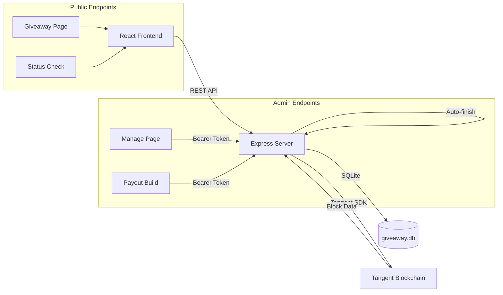

     
    
    <h3>Tangent Giveaway App</h3>

[![Project website](https://img.shields.io/badge/Tangent-Giveaway-b0f406.svg?logo=data:image/svg+xml;base64,PHN2ZyB4bWxucz0iaHR0cDovL3d3dy53My5vcmcvMjAwMC9zdmciIHhtbG5zOnhsaW5rPSJodHRwOi8vd3d3LnczLm9yZy8xOTk5L3hsaW5rIiB2ZXJzaW9uPSIxLjEiIHdpZHRoPSI2NDBweCIgaGVpZ2h0PSI2NDBweCIgc3R5bGU9InNoYXBlLXJlbmRlcmluZzpnZW9tZXRyaWNQcmVjaXNpb247IHRleHQtcmVuZGVyaW5nOmdlb21ldHJpY1ByZWNpc2lvbjsgaW1hZ2UtcmVuZGVyaW5nOm9wdGltaXplUXVhbGl0eTsgZmlsbC1ydWxlOmV2ZW5vZGQ7IGNsaXAtcnVsZTpldmVub2RkIj4gDQogICAgPHJlY3QgZmlsbD0iI2IwZjQwNiIgeD0iMCIgeT0iMCIgd2lkdGg9IjY0MCIgaGVpZ2h0PSI2NDAiIHJ4PSIxNjAiIHJ5PSIxNjAiLz4NCiAgICA8cGF0aCBmaWxsPSIjMDAwMDAwIiBkPSJNIDMwNS41LDEzOS41IEMgMzA4LjI2NSwxMzkuNzk4IDMxMC43NjUsMTQwLjc5OCAzMTMsMTQyLjVDIDMyMC44MzksMTUyLjg1MyAzMjguMTcyLDE2My41MiAzMzUsMTc0LjVDIDM0Ny45MTQsMTk1LjMyNSAzNjAuNTgxLDIxNi4zMjUgMzczLDIzNy41QyA0MDguNDI2LDI5Mi41ODcgNDQzLjQyNiwzNDcuOTIgNDc4LDQwMy41QyA0ODQuMzAyLDQxNC4xMjEgNDkwLjEzNiw0MjQuOTU1IDQ5NS41LDQzNkMgNDk0LjA4NCw0MzguODM1IDQ5Mi40MTcsNDQxLjUwMiA0OTAuNSw0NDRDIDM3Ni44MzQsNDQ0LjUgMjYzLjE2Nyw0NDQuNjY3IDE0OS41LDQ0NC41QyAxNDcuODE5LDQ0MS43OTcgMTQ2LjE1Myw0MzkuMTMxIDE0NC41LDQzNi41QyAxNDcuNjMzLDQyOC41MTkgMTUxLjQ2Nyw0MjAuODUyIDE1Niw0MTMuNUMgMTc4Ljc0OCwzNzcuNjczIDIwMS4yNDgsMzQxLjY3MyAyMjMuNSwzMDUuNUMgMjM1Ljk2OSwyODUuMjQ4IDI0OC45NjksMjY1LjI0OCAyNjIuNSwyNDUuNUMgMjY0LjE0NSwyNDQuMzA0IDI2NS44MTEsMjQzLjMwNCAyNjcuNSwyNDIuNUMgMjczLjE3OSwyNDMuMzM5IDI3Ny4zNDYsMjQ2LjMzOSAyODAsMjUxLjVDIDI5Ny4wMjUsMjc3Ljg0OSAzMTMuMTkyLDMwNC42ODIgMzI4LjUsMzMyQyAzMjMuNTk1LDM0MC44OTkgMzE2LjI2MiwzNDYuODk5IDMwNi41LDM1MC4wQyAzMDMuNTE4LDM1MC40OTggMzAwLjUxOCwzNTAuNjY1IDI5Ny41LDM1MC41QyAyOTYuMzEyLDM0OS42MzYgMjk1LjE0NSwzNDguNjM2IDI5NCwzNDcuNUMgMjg2LjMwNCwzMzQuOTkyIDI3OC40NywzMjIuNjYgMjcwLjUsMzEwLjVDIDI2OS4xOTIsMzA2LjU5NyAyNjcuNjkyLDMwNi41OTcgMjY2LDMxMC41QyAyNDkuMDYyLDMzOC40MzMgMjMxLjcyOSwzNjYuMDk5IDIxNCwzOTMuNSBDIDIxMS4yNzQsMzk3LjYxOSAyMDkuMTA3LDQwMS45NTIgMjA3LjUsNDA2LjVDIDIxNy4wNDMsNDA2LjYyOSAyMjYuMzc3LDQwNi42MjkgMjM1LjUsNDA2LjVDIDI4OS4yNjQsNDA3LjgzIDM0Mi45MzEsNDA3LjgzIDM5Ni41LDQwNi41QyA0MDguNSw0MzIuNSA0MTYuMzU5LDQxMy4yMDcgNDI0LjUsNzk0LjVDIDQzMi44NTksNTEwLjY1IDQ0MC43NzIsNTE4LjA3NSA0NDkuNSw1MjguNUMgNDYzLjU2Miw1NDcuOTMgNDc3LjA4MSw1NjguNjI1IDQ5MC41LDU4OS41QyA1MjEuNzI4LDYzNy41IDU0Ni41LDY4NS41IDU0Ni41LDY4NS41IiAvPg08L3N2Zz4NCg==)](https://try.tangent.cash)

## Project Information

Tangent Giveaway App is a decentralized giveaway management system on the Tangent Protocol blockchain, providing a trustless, transparent platform for hosting giveaways with cryptographically secure winner selection. This application enables giveaway organizers to create structured contests where winners are determined deterministically using blockchain block proofs, ensuring fairness and verifiability.

### Cryptographically Secure Winner Selection

The core feature of this application is its **SHA-256 based winner selection algorithm** that:
- Uses all entropy from the 5200-bit block.pow.proof for cryptographic randomness
- Produces deterministic results: same proof + participants always yields the same winners
- Shuffles participants using a Linear Congruential Generator (LCG) seeded with composite entropy from the block proof and wallet addresses
- Ensures permutation sensitivity: the order of participants affects the shuffle outcome

### Privacy-Focused Design

To protect participant privacy, the application:
- Hashes wallet addresses using `SHA-256(giveaway_id + address)` before any display
- Only shows the first 16 characters of wallet hashes publicly
- Maintains full address data internally for winner verification
- Separates public endpoints (no sensitive data) from admin endpoints (requires authentication)

### Giveaway Management Features

Organizers can configure:
- **Target Block**: Automatic giveaway completion when a specific blockchain block is reached
- **Prize Distribution**: Flexible winner ranges with configurable counts and amounts
- **Rules**: Custom participation requirements displayed to users
- **Social Integration**: X (Twitter) and Discord username collection
- **Discord Rewards**: Optional bonus prizes for participants who provide Discord usernames
- **Mandatory Discord**: Option to require Discord username for eligibility

### Auto-Finish System

A background service runs every minute to:
1. Check all active giveaways with target blocks
2. Verify if the target blockchain block exists
3. Automatically finish giveaways once their target block is reached
4. Calculate and store winner results using the block proof

### Payout Generation

For finished giveaways, the admin panel can:
- Build unsigned payout transactions for prize distribution
- Include Discord reward bonuses in the transaction
- Open Tangent Protocol interface for signing and broadcasting

## Architecture & Technical Details

### Tech Stack

- **Database**: SQLite with [better-sqlite3](https://github.com/WiseLibs/better-sqlite3) for synchronous, high-performance operations
- **Backend**: [Express.js](https://expressjs.com/) with TypeScript for type-safe server code
- **Frontend**: [React](https://react.dev/) with [Vite](https://vitejs.dev/) for fast development and bundling
- **Blockchain Integration**: [tangentsdk](https://github.com/tangentcash/sdk) for blockchain RPC calls and transaction building
- **Big Number Handling**: [bignumber.js](https://github.com/MikeMcl/bignumber.js) for precise arithmetic with token amounts

### Security Features

- **Admin Authentication**: Bearer token-based authorization for all management endpoints
- **Input Validation**: Strict validation for Tangent addresses, X usernames (4-15 chars, alphanumeric + underscore), and Discord usernames
- **CORS Configuration**: Configurable cross-origin resource sharing for frontend-backend communication
- **Environment Variables**: Sensitive data (admin token) loaded from `.env` file

## API Endpoints

### Public Endpoints

| Method | Endpoint | Description |
|--------|----------|-------------|
| `GET` | `/giveaway/:id` | Get giveaway details (no participant data) |
| `GET` | `/giveaway/:id/status/:address` | Check participant approval status |
| `POST` | `/giveaway/:id/participant` | Register a new participant |

### Admin Endpoints (requires `Authorization: Bearer <token>` header)

| Method | Endpoint | Description |
|--------|----------|-------------|
| `GET` | `/giveaway/:id/manage` | Get full giveaway data with participants |
| `PUT` | `/giveaway/:id/manage` | Update giveaway settings |
| `PATCH` | `/giveaway/:id/participant/:pid` | Approve or reject a participant |
| `POST` | `/giveaway/:id/build-payout` | Build unsigned payout transaction |

## Dependencies

* [better-sqlite3](https://github.com/WiseLibs/better-sqlite3)
* [bignumber.js](https://github.com/MikeMcl/bignumber.js)
* [cors](https://github.com/expressjs/cors)
* [dotenv](https://github.com/motdotla/dotenv)
* [express](https://github.com/expressjs/express)
* [react](https://github.com/facebook/react)
* [react-markdown](https://github.com/remarkjs/react-markdown)
* [react-router-dom](https://github.com/remix-run/react-router)
* [remark-gfm](https://github.com/remarkjs/remark-gfm)
* [tangentsdk](https://github.com/tangentcash/sdk)

## Configuration

Environment variables required:

| Variable | Description | Example |
|----------|-------------|---------|
| `TOKEN` | Admin authentication bearer token | `your-secure-random-token-here` |

The application runs on port `20420` by default.

## License

This project is licensed under the MIT license